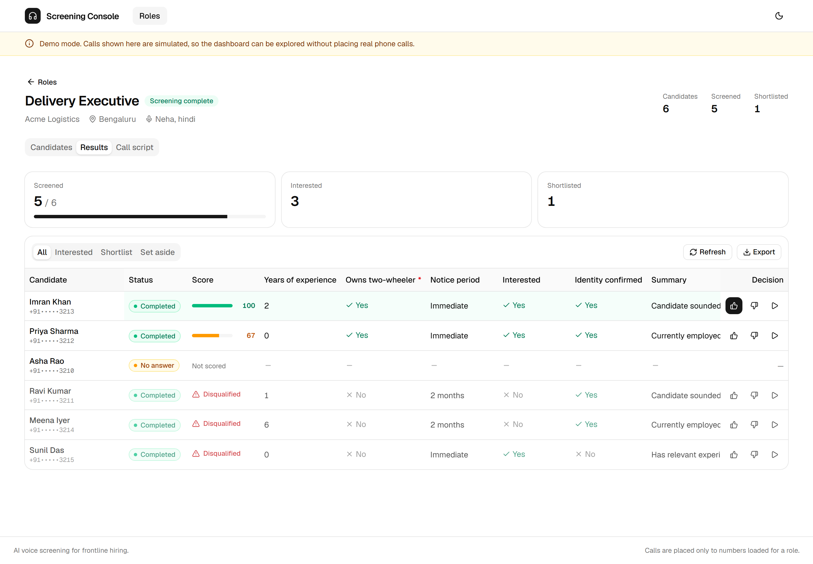

# Screening Console

Screen job candidates by AI voice call, and review what they said in one place.

A recruiter defines a role and the questions they want asked, loads candidates,
and launches calls. Hunar's voice agents conduct the interviews in Hindi, Tamil
or English, and the extracted answers land in a dashboard with transparent
scoring and a ranked shortlist.

Built for the Hunar.ai assignment.

| | |
|---|---|
| **Live app** | _to be filled in on deploy_ |
| **API docs** | _to be filled in on deploy_ `/docs` |
| **Source** | this repository |



---

## What works today

- Create a role from a job description and a list of screening questions.
- **See the exact call script before anyone is phoned.** The generated agent
  prompt and extraction schema are shown beside the form as you type.
- Add candidates by hand or import a spreadsheet, with bad rows reported rather
  than silently dropped.
- Launch screening calls, with a confirmation stating how many real phone calls
  are about to be placed.
- Watch call status update live.
- Review answers in a table whose columns are built from that role's questions,
  with the coerced value and the candidate's literal words side by side.
- Transparent scoring, ranked shortlist, CSV export.

## Five things the API taught us

The published documentation left several things unstated. These were established
by reading the live OpenAPI schema, and each one changed the design.

| Finding | Consequence |
|---|---|
| `result_schema` is a flat map of field name to type hint, and it lives on the **agent**, not the call | One agent must be created per job role. A shared agent could not carry per-role extraction at all |
| Extracted values come back as **strings** whatever type was declared. A `"boolean"` field returns `"Yes"` | A coercion layer is mandatory, not a nicety |
| The status webhook fires **only at terminal states** | Live progress cannot come from webhooks. Polling is infrastructure here, not a fallback |
| The `call_result_done` payload contains **no call identifier** | Correlation moved into the callback URL as an opaque token |
| Prompt templating uses **single braces**, and `custom_data` is strings only | Every pasted job description must be brace-stripped, or a salary range corrupts what the agent says aloud |

Also: agent creation accepts no `conclusion` or `silence_response` despite the
prose mentioning them, callbacks must be HTTPS, guardrails need three distinct
days and a three-hour window, and `retry_interval_hours` accepts only
0, 3, 6, 9, 12 or 24.

## Architecture

```
apps/api          FastAPI. Two independent domains sharing core + the SDK.
  app/core        Config, logging, errors, shared call and webhook tables
  app/hiring      Screening applicants
  app/people      Sourcing and outreach
  app/webhooks    Signed webhook receiver, shared by both domains
apps/web          Next.js App Router, TypeScript strict, shadcn/ui
packages/hunar-sdk  Typed voice client, webhook verification, demo client
```

`hiring` and `people` may never import each other. That is enforced by an
architecture test rather than a comment, because the rule is directional and a
lint rule cannot express it.

Frontend types are **generated from the backend's OpenAPI schema**
(`npm run gen:api`), so a renamed field is a compile error rather than an
`undefined` at runtime.

## Decisions worth defending

**A call POST is never retried.** If it times out the call may still have been
placed, and `GET /calls/` cannot be filtered by `request_id` to check. Retrying
would risk a second real phone call to a real person, so the attempt is parked
as `UNKNOWN` and the reconciler resolves it.

**Reconciliation runs lazily on read, not in a worker.** No scheduler, it
survives a host that sleeps between requests, and it cannot drift out of step
with what the user is looking at.

**Editing a role's questions after calls exist is refused.** Stored answers only
mean something against the schema that produced them. Silently changing the
questions would silently change what past results mean.

**Unparseable is never "no".** An answer the coercion layer cannot read becomes
null, not false. Reading "I'm not sure" as a refusal would reject a candidate
for hesitating, which is the one error here with a human cost.

**An unanswered hard requirement never disqualifies anyone.** A knockout fires
only on a clear, judged failure, and always shows its reason.

**Scoring is rule-based, not a model judgement.** This ranks people for
employment. A weighted rule can be audited, reproduced and challenged, and it
explains itself field by field. Every score in the UI comes with its reasoning.

**Demo mode is honest.** When the voice key expires the app serves simulated
calls and says so in a banner on every screen. The demo client returns strings
and fires webhooks only at terminal states exactly as the real API does, so it
exercises the production code path rather than bypassing it.

## Running it locally

Requires [uv](https://docs.astral.sh/uv/), Node 20+, and a Postgres database
(a free [Neon](https://neon.tech) project works).

```bash
cp .env.example .env          # then fill in DATABASE_URL
uv sync --all-packages
cd apps/api && uv run alembic upgrade head && cd ../..

# terminal 1
uv run uvicorn app.main:app --reload --port 8000

# terminal 2
cd apps/web && npm install && npm run dev
```

Open <http://localhost:3000>. With `HUNAR_MODE=mock` it runs end to end with no
credentials at all.

**To use the real voice API**, put the key in `HUNAR_API_KEY`, set
`HUNAR_MODE=auto`, and expose the backend over HTTPS so webhooks can reach it:

```bash
ngrok http 8000        # then set PUBLIC_API_BASE_URL to the https URL
uv run python scripts/spike.py                       # read-only probes
uv run python scripts/spike.py --call +91XXXXXXXXXX --confirm   # one real call
```

The spike answers the blocking questions before any product code depends on
them, and saves every response as a fixture.

## Tests

```bash
uv run pytest                # 314 tests
uv run ruff check . && uv run mypy packages/hunar-sdk/src apps/api/src scripts
cd apps/web && npm run typecheck && npm run lint && npm run build
```

Depth over breadth. The heavily covered parts are the ones where being wrong
costs something: webhook signature verification, answer coercion, the scoring
engine, and prompt generation. The suite runs on SQLite so it needs no database
server; the models declare JSON columns as a variant that is JSONB on Postgres.

## Deploying

Backend to Render, frontend to Vercel, database on Neon.

1. Push to GitHub. Render reads `render.yaml`.
2. Create the Render service, and set the secrets marked `sync: false`.
3. Set `PUBLIC_API_BASE_URL` to the service's own URL and redeploy. It is the
   root of every webhook callback URL, and Hunar rejects non-HTTPS callbacks.
4. Deploy `apps/web` on Vercel with `NEXT_PUBLIC_API_BASE_URL` pointing at it.
5. Add the Vercel domain to `CORS_ORIGINS` on Render.

Deploy the backend first: step 3 depends on knowing its URL.

## Security

The Hunar key is also the HMAC secret for inbound webhooks, so a browser-visible
copy would let anyone forge webhooks that mutate call records. It therefore lives
only in the backend process. `.gitignore` was written before `git init`, so no
credential has ever entered this repository's history. Logs redact keys,
signatures and phone numbers by processor rather than at each call site. Phone
numbers are masked to their last four digits everywhere they are displayed.

## Limitations, honestly

- **Reconciliation is in-process**, so the API is pinned to one instance. Real
  scale needs a separate worker holding a lock. The seam is there; the worker is
  not.
- **The voice agent has not been heard.** The prompts are written carefully but
  prompt quality is only knowable from real calls, and the assignment key was
  not exercised against a live number.
- **No authentication.** A shared demo password gates the deployment. Real use
  needs per-recruiter accounts and an audit trail of who rejected whom.
- **Recordings are proxied, not stored.** Provider URLs are likely to expire
  with the key.
- Retry policy, calling-hours guardrails and per-candidate language are
  supported by the API client but not yet exposed in the UI.

## Repository

```
docs/build-plan.md      the plan this was built against
scripts/spike.py        day-zero API probe, run before writing product code
scripts/dump_openapi.py regenerates the frontend's types from the backend
```
